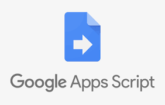

	
		

	<h1>Auto Acompanhamento 2.0 📄</h1>	
	<a href="https://github.com/felipejsborges/automated-tasks-middleschool/tree/master/auto-acompanhamento">Back previous page</a>

### What is? 🤔
A program to automatically fill google sheets that are used to manage activities in quarentine period.

### How does this activities works? ⚙️
Teachers does not need to fill the sheets anymore (like they do when using [v1](https://github.com/felipejsborges/automated-tasks-middleschool/tree/master/auto-acompanhamento/v1)), because I create some scripts to do this job automatically. 

### What does this program do? 🤖
- Get responses of Google Forms student activities
- Fill a database with these responses
- Fill cell on sheet with a "X" if that student (line) has done the activity of that subject (column), by consulting the database

### Which technologies were used? 💻
- Google App Scripts

### Look at the final result 📺
I created a [video in Portuguese-BR]() that I show more details. Watch it!

by Felipe Borges 
[LinkedIn](https://www.linkedin.com/in/felipejsborges) | [GitHub](https://github.com/felipejsborges) 
With great help of Andre Pinto 
[LinkedIn](https://www.linkedin.com/in/pinto-andre/) | [GitHub](https://github.com/andre6293) 

